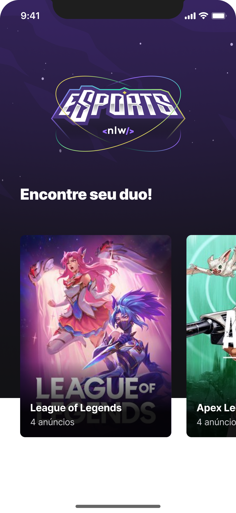

<h1 align="center">
  <!--  -->
  
  
NLW ESPORTS | MOBILE

</h1>

<h2> O que é esse projeto? </h2>

 
  NLW ESPORTS  é uma aplicação com o intuito de conectar usuários que 
  desejam encontrar parceiros em jogos online. Através dele é possível
  criar e consumir anúncios para que outros usuários entre em contanto.

  

  <h2>A aplicação é composta em 3 partes:</h2>
  <ul>
    <li><a src="https://github.com/Th-Fernandes/NLW-ESPORTS-BACKEND">Backend</a></li>
    <li><a src="https://github.com/Th-Fernandes/NLW-ESPORTS-WEB">Versão Web</a></li>
    <li><a src="https://github.com/Th-Fernandes/NLW-ESPORTS-MOBILE">Versão Mobile</a></li>
  <ul>

  <h2>Ferramentas utilizadas (versão mobile)</h2>
  <ul>
    <li>React Native</li>
    <li>Expo</li>
    <li>Typescript</li>
    <li>Phosphor</li>
  </ul>

  <h2> Autor </h2>
  <ul>
    <li><a src="https://www.linkedin.com/in/thiago-fernandes-front/">LinkedIn</a></li>
    <li><a src="https://www.instagram.com/thiagofernades.dev/">Instagram com conteúdos de programação</a></li>
  <ul>

